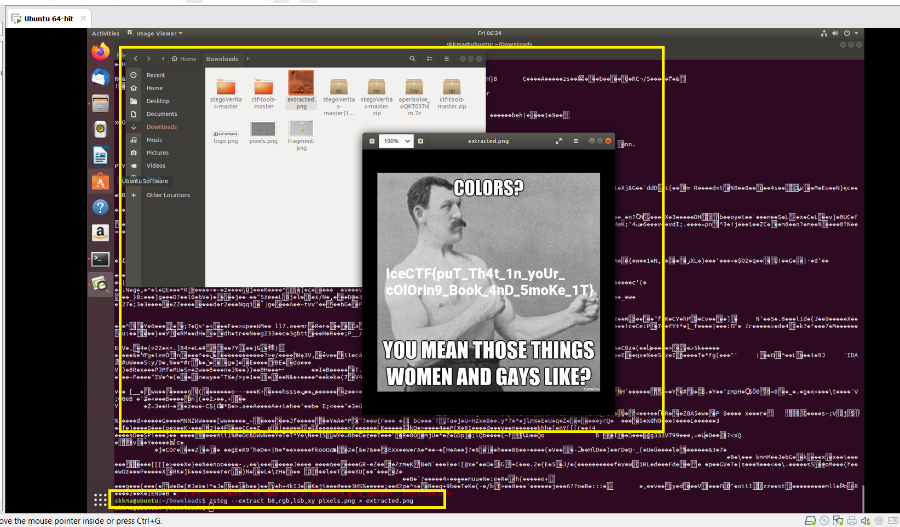

## Write-up cách giải challenge
Sau khi kiểm tra 1 lượt với các tool cơ bản: file, strings, binwalk, foremost,... không có kết quả thì với zsteg, chúng ta đã thấy có dấu hiệu: 

Sau khi extract file png đó, chúng ta đã nhận được flag: 

>Flag: IceCTF{puT_Th4t_1n_yoUr_cOlOrin9_Book_4nD_5moKe_1T}
## Write-up cách tạo challenge
Chúng ta sẽ sử dụng [StegOnline](https://github.com/Ge0rg3/StegOnline) để tạo chall dạng này.
Upload original file -> Embed Files/Data -> Điều chỉnh thông số và nhập Input Data hoặc Flag file: 

Hoila! 

Kết quả từ zsteg: 

File được zsteg extract: 

## Demo Challenge
[pixels-demo](dsfds)
