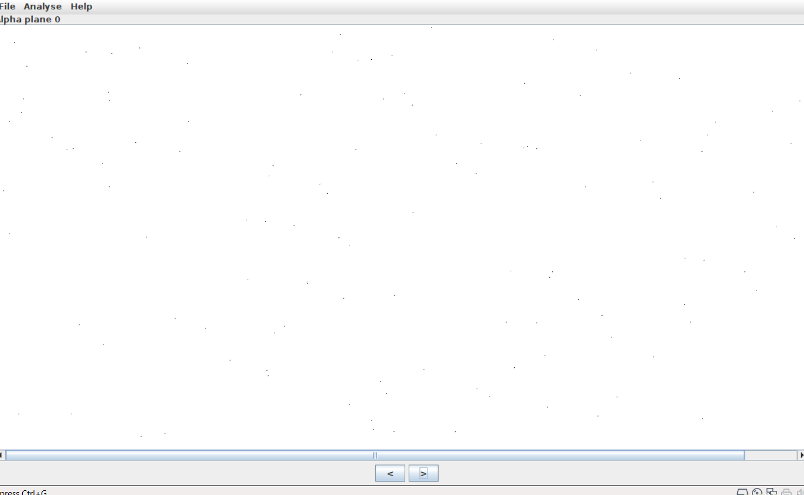
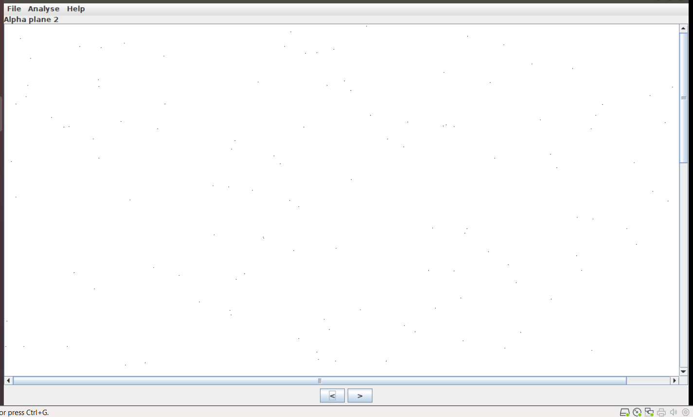
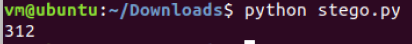
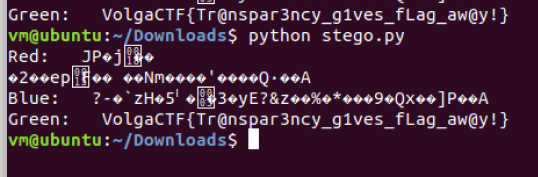

# Task 1.1: Dissolved

[File](stego.png)

Lại là chall Stego, chúng ta bắt đầu với file, strings, exiftool, binwalk,... không có kết quả.
Sau khi sử dụng steg solve, chúng ta thấy có vài pixel lạ ở Alpha plane 0 và Alpha plane 2





Chúng ta sẽ sử dụng python để kiểm tra pixel lạ đó

```python
from PIL import Image
img = Image.open("stego.png")
pixels = img.load()
h = img.size[0]
w = img.size[1]
output = ''
strapx = []
for row in range(w):
    for col in range(h):
        r,g,b,a = pixels[col,row]
        if a < 255:
            strapx.append(pixels[col,row])
print(len(strapx))
```



Chúng ta có 312 ký tự, ta có 312/8=39 ký tự, phù hợp cho một flag. Chúng ta chưa biết nơi nào chứa flag.==> Chúng ta sẽ tiến hành lấy LSB của từng kênh màu riêng biệt và xem kết quả:

```python
from PIL import Image
img = Image.open("stego.png")
pixels = img.load()
h = img.size[0]
w = img.size[1]
output = ''
for row in range(w):
    for col in range(h):
        r,g,b,a = pixels[col,row]
        if a < 255:
            lsbr = r & 1
            lsbg = g & 1
            lsbb = b & 1
            outputr += str(lsbr)
            outputg += str(lsbg)
            outputb += str(lsbb)
print('Red:   ' + ''.join(chr(int(outputr[i*8:i*8+8],2)) for i in range(len(outputr)//8)))
print('Blue:   ' + ''.join(chr(int(outputg[i*8:i*8+8],2)) for i in range(len(outputg)//8)))
print('Green:   ' + ''.join(chr(int(outputb[i*8:i*8+8],2)) for i in range(len(outputb)//8)))
```

Chúng ta có kết quả:



> Flag: VolgaCTF{Tr@nspar3ncy_g1ves_fLag_aw@y!}