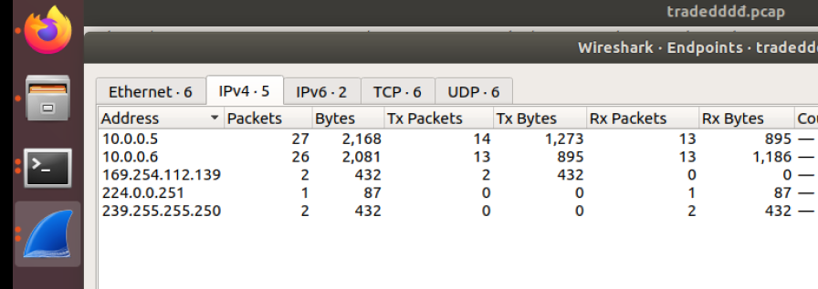
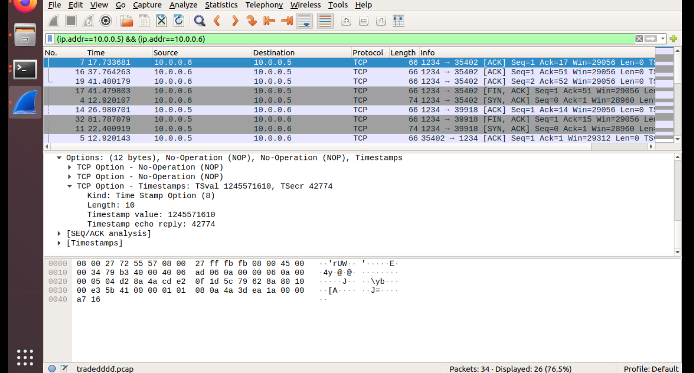
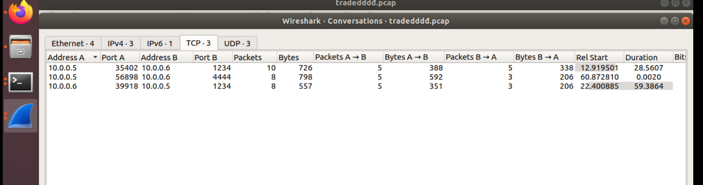
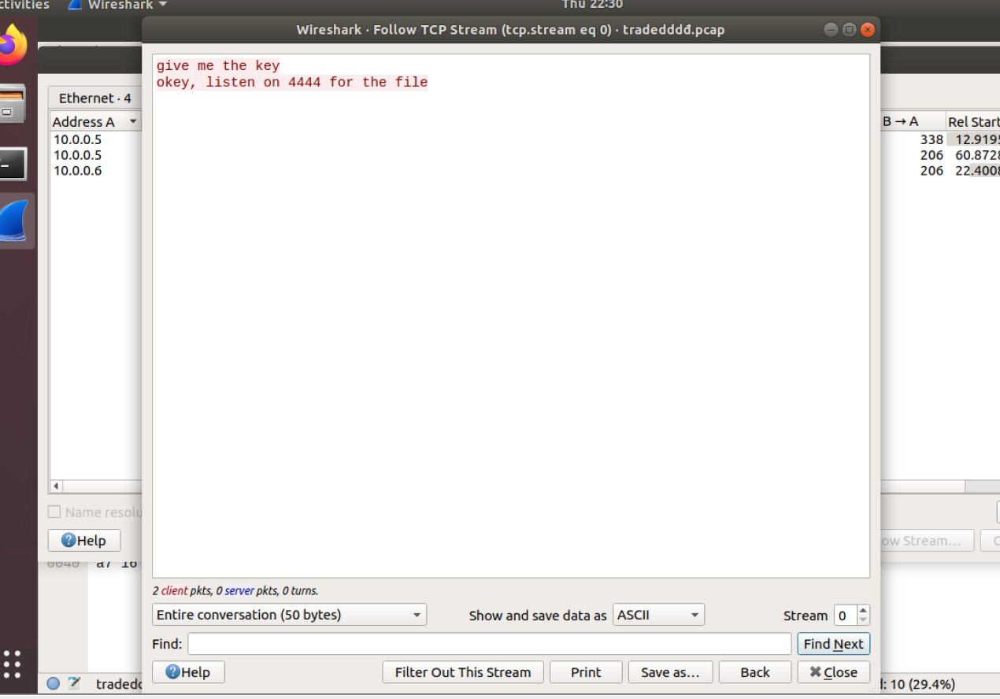
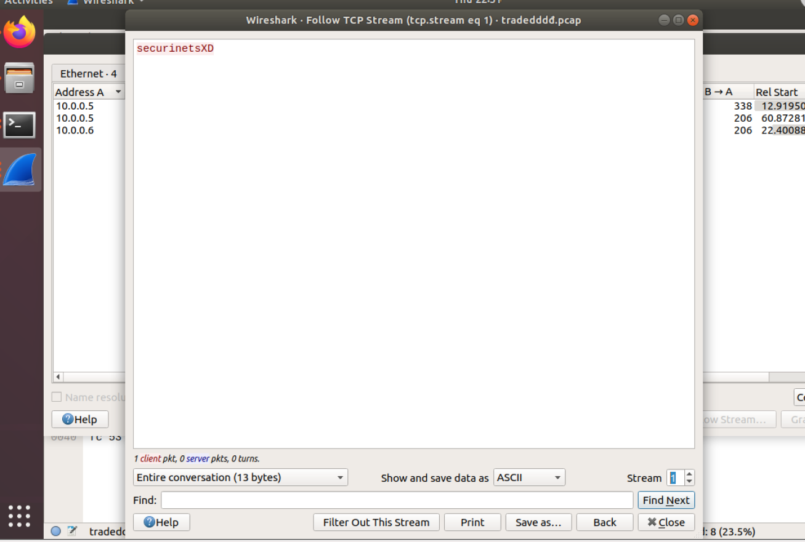
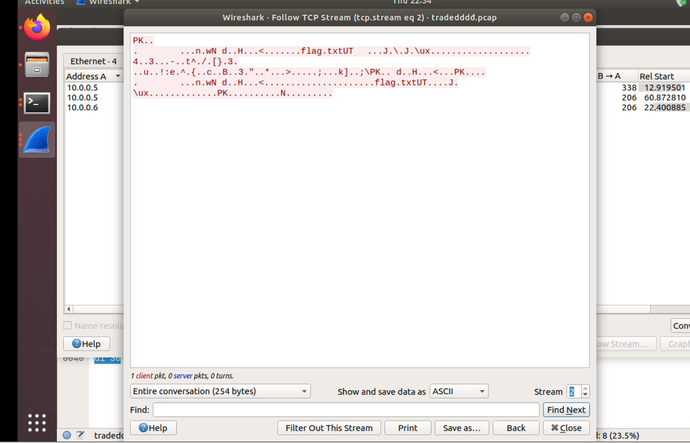
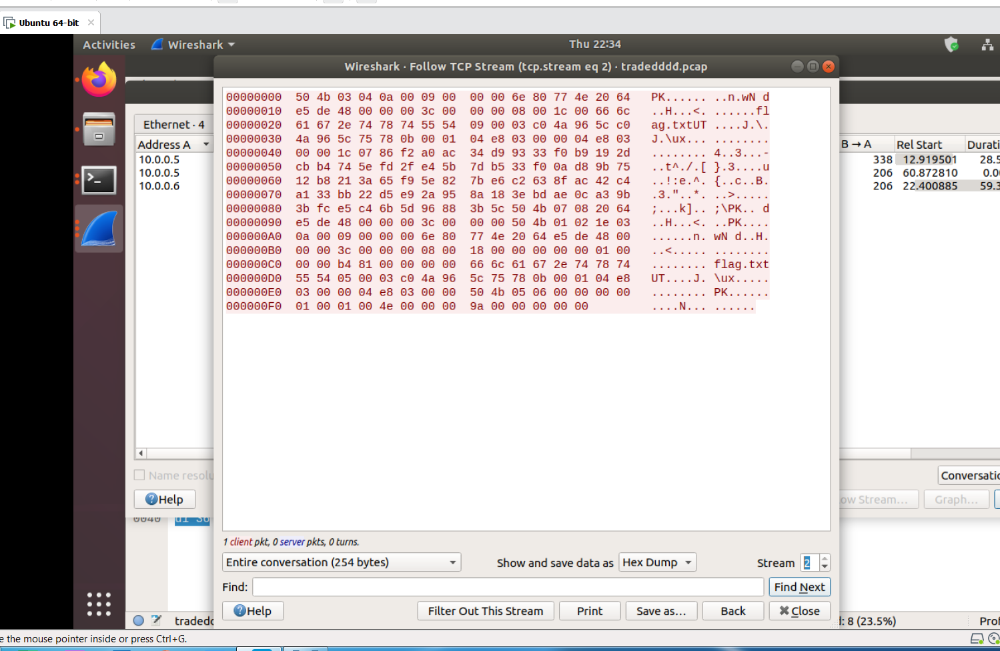
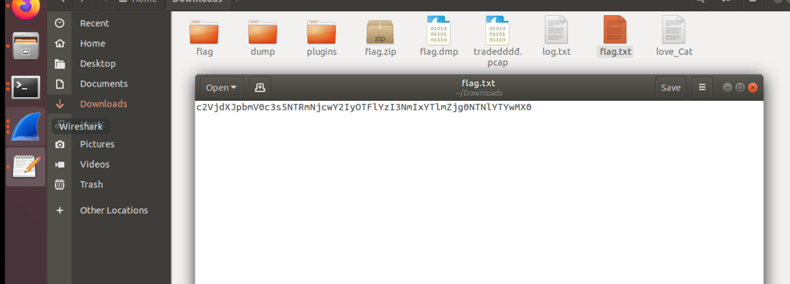

# Task 2: Tradedddddddđ
[File](tradedddđ.pcap)
Trong chall này, chúng ta đã có một file pcap, và ý tưởng đầu tiên luôn là đọc danh sách các IP bắt được để biết phải làm gì:
> Statistics -> Enpoint List -> IP v4

Có 2 IP đáng chú ý: 10.0.0.5 và 10.0.0.6, chúng chiếm tỉ lệ cao trên tổng thể, ta sẽ sử dụng filter để theo dõi...
> Apply as Filter -> Selected
Apply as Filter -> ...and Selected

Khi nhìn vào khung chính của wireshark ta sẽ thấy có rất nhiều gói tin, nhưng phần lớn trong chúng là những gói tin chào hỏi, xác thực, truyền nhận dữ liệu của một phiên TCP nào đó Để xem số phiên TCP hiện có, vào
> Menu Statistics –> Conversations, tab TCP. 

Chúng ta sẽ thấy thực tế chỉ có 3 phiên qua các cổng khác nhau:
Chúng ta sẽ xem xét từng phiên một. Chúng ta có thể theo dõi các luồng bằng cách chọn phiên đầu tiên -> Follow Stream...

Không có thông tin gì, chúng ta sẽ chuyển đến phiên tiếp theo...

Cũng không có gì...

Nhìn vào header, ta thấy đây là một file ZIP (PK), có thể xác nhận bằng show hex dump:

Save file, ta được file flag.zip
Tuy nhiên giải nén ta cần mật khẩu, đó chính là key đã được nhắc ở phiên TCP trước...
> securinetsXD

Giải nén file zip ta được Flag:

> Flag: c2VjdXJpbmV0c3s5NTRmNjcwY2IyOTFlYzI3NmIxYTlmZjg0NTNlYTYwMX0